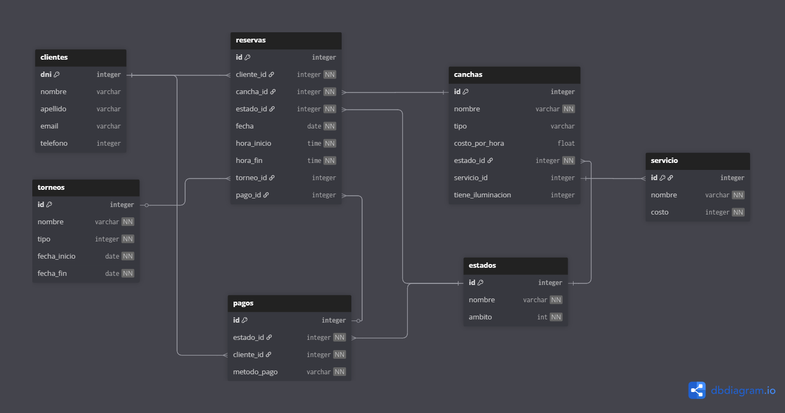
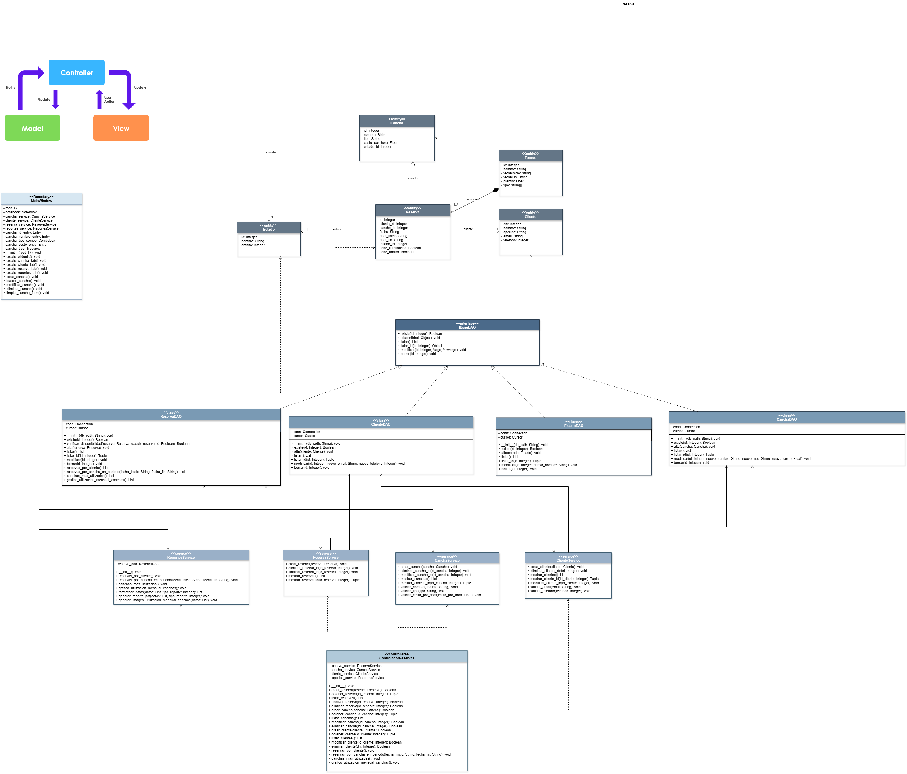

# G12 - TPI - Reservas de canchas

En este README.md se deja la constancia del Trabajo Práctico Integrador de Desarrollo de Aplicaciones con Objetos, siguiendo la estructura de actividades propuestas por la cátedra a resolver con los links e imágenes correspondientes a los diagramas de la documentación requerida.

---

## Resumen de Funcionalidades

El sistema permite gestionar las reservas de canchas deportivas de un complejo.

Sirve para administrar clientes, canchas, horarios, torneos y servicios adicionales (como iluminación o árbitros), garantizando la disponibilidad de las canchas, evitando el solapamientos de horarios. Además, se incluyen reportes estadísticos sobre la utilización de las canchas y se permite el registro de pagos asociados a las reservas/torneos.

El *objetivo* principal es digitalizar y optimizar el proceso de reserva, eliminando los conflictos generados por la superposición de horarios, brindando información clara sobre la ocupación y facturación del complejo.

---

## Casos de Uso

Las funcionalidades que proponemos resolver son las que listamos en la siguiente tabla:

| Nº  | Caso de Uso                                                      | Descripción de CU                                                                                         |
| ---- | ---------------------------------------------------------------- | ---------------------------------------------------------------------------------------------------------- |
| CU1  | **Registrar Cliente**                                      | Permitir ingresar un nuevo cliente en el sistema validando que el DNI no esté repetido.                  |
| CU2  | **Modificar / Eliminar Cliente**                           | Actualizar/elimina datos de clientes existentes.                                                           |
| CU3  | **Registrar Cancha**                                       | Crear una nueva cancha con su tipo, costo y servicios asociados.                                           |
| CU4  | **Modificar estado de Cancha**                             | Permitir actualizar el estador una cancha.                                                                |
| CU5  | **Registrar Reserva**                                      | Crear una reserva vinculando cliente, cancha, fecha y hora. Verificar disponibilidad antes de confirmarla. |
| CU6  | **Modificar Reserva**                                      | Permitir cambiar horario o anular una reserva existente.                                                   |
| CU7  | **Consultar Disponibilidad**                               | Mostrar las canchas disponibles en una fecha y franja horaria.                                             |
| CU8  | **Registrar Torneo**                                       | Permitir crear torneos, asignando canchas y vincular reservas.                                             |
| CU9  | **Registrar Pago**                                         | Registrar el pago de una reserva o torneo indicando monto, fecha y método.                                |
| CU10 | **Registrar Servicio**                                     | Registrar el servicio asociado a una cancha en particular.                                                 |
| CU11 | **Generar Reporte de Reservas por Cliente**                | Generar reporte con todas las reservas realizadas por un cliente, con fechas y estados.                   |
| CU12 | **Generar Reporte de Reservas por Cancha y Período**      | Generar reporte de las reservas de una cancha dentro de un rango de fechas.                                |
| CU13 | **Generar Reporte de Canchas más Utilizadas**             | Generar reporte que indica cuáles son las canchas con mayor cantidad de reservas.                         |
| CU14 | **Generar Gráfico Estadístico de Utilización Mensual** | Generar gráficos (barras o tortas) con la ocupación mensual de las canchas.                              |

---

## Patron aplicado

Hemos aplicado el patron DAO para gestionar las consultas CRUD separando la logica de negocio de la persistencia en la Base de Datos y una arquitectura monolitica de tipo MVC para la organizacion del codigo.

## Diagrama de Entidades-Relación

Para realizar el DER hemos utilizado la herramienta dbdiagram.io, el diagrama que hemos propuesto es el siguiente:

---

## Diagrama de Clases

Hemos construido un diagrama de clases con la herramienta draw.io. El diagrama que propusimos es el siguiente:

---

### Integrantes del grupo

| Legajo | Apellido y Nombre         | mail                            |
| ------ | ------------------------- | ------------------------------- |
| 93203  | Ceballos Pratto, Agustín | agusceballos000@gmail.com       |
| 95309  | Fernandez, Julian         | julianfernandez159155@gmail.com |
| 94416  | Pecchio, Valentina        | valuupecchio@gmail.com          |
| 91541  | Villegas, Genaro          | gvillegaslearning@gmail.com     |
| 89390  | Wendler, Juan José       | juanjoowendler@gmail.com        |
